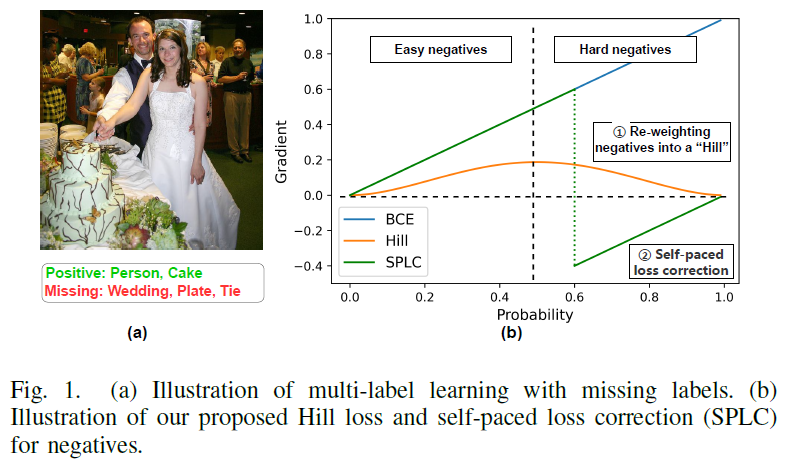

# Simple and Robust Loss Design for Multi-Label Learning with Missing Labels


Official PyTorch Implementation of the paper [Simple and Robust Loss Design for Multi-Label Learning with Missing Labels](https://arxiv.org/abs/2112.07368)

> Youcai Zhang, Yuhao Cheng, Xinyu Huang, Fei Wen, Rui Feng, Yaqian Li, Yandong Guo
> <br/> OPPO Research Institute, Shanghai Jiao Tong University, Fudan University


**Abstract**

Multi-label learning in the presence of missing labels(MLML) is a challenging problem. Existing methods mainly focus on the design of network structures or training schemes, which increase the complexity of implementation. This work seeks to fulfill the potential of loss function in MLML without increasing the procedure and complexity. Toward this end, we propose two simple yet effective methods via robust loss design based on an observation that a model can identify missing labels during training with a high precision. The first is a novel robust loss for negatives, namely the Hill loss, which re-weights negatives in the shape of a hill to alleviate the effect of false negatives. The second is a self-paced loss correction (SPLC) method, which uses a loss derived from the maximum likelihood criterion under an approximate distribution of missing labels. Comprehensive experiments on a vast range of multi-label image classification datasets demonstrate that our methods can remarkably boost the performance of MLML and achieve new state-of-the-art loss functions in MLML.

<p align="center">
 <table class="tg">
  <tr>
    <td class="tg-c3ow"></td>
  </tr>
</table>
</p>


## Credit to previous work
This repository is built upon the code base of [ASL](https://github.com/Alibaba-MIIL/ASL), thanks very much!

<!-- ## Pretrained Models
In this [link](MODEL_ZOO.md), we provide pre-trained models on various
dataset.  -->
## Datasets
We construct the training sets of missing labels by randomly dropping positive labels of each training image with different ratios. 

|          |samples | classes | Labels | avg. label/img |File |
|----------|:----:|:---:|:---:|:---:|:---:|
|  COCO-full labels| 82,081 | 80   | 241,035 |  2.9  |[coco_train_full.txt](./dataset/coco_train_full.txt) |
|  COCO-75% labels left     | 82,081 | 80   | 181,422   |  2.2  | [coco_train_0.75left.txt](./dataset/coco_train_0.75left.txt) |
|  COCO-40% labels left          | 82,081 | 80 | 96,251   |  1.2  | [coco_train_0.4left.txt](./dataset/coco_train_0.4left.txt) |
|  COCO-single label         | 82,081 | 80 | 82,081   |  1.0  | [coco_train_singlelabel.txt](./dataset/coco_train_singlelabel.txt) |
|  NUS-full label         | 119,103 | 81 | 289,460   |  2.4  | [nus_train_full.txt](./dataset/nus_train_full.txt) |
|  NUS-single label         | 119,103 | 81 | 289,460   |  1.0  | [nus_train_singlelabel.txt](./dataset/nus_train_singlelabel.txt) |


## Loss Implementation
In this PyTorch [file](./src/loss_functions/losses.py), we provide 
implementations of our loss functions: `Hill` and `SPLC`. The loss functions take `logits` (predicted logits before sigmoid) and `targets` as input, and return the loss. Note that `SPLC` also takes current training epoch as input.     

- ```class Hill(nn.Module)```
- ```class SPLC(nn.Module)```

## Training Code
Training models by selecting different losses on MS-COCO:

```python
python train.py --loss Hill --data {path to MS-COCO} --dataset {select training dataset}
```

```python
python train.py --loss SPLC --data {path to MS-COCO} --dataset {select training dataset}
```

For example:

```python
python train.py --loss Hill --data '/home/MSCOCO_2014/' --dataset './dataset/coco_train_0.4left.txt'
```
Note that when SPLC is used on COCO-75% labels left, the threshold is set 0.65, and the hyperparameters in other cases are set by default.

Training models by selecting different losses on NUS-wide:

```python
python train_nus.py --loss Hill --data {path to NUS-wide}
```

```python
python train_nus.py --loss SPLC --data {path to NUS-wide} 
```

## Validation Code
We provide validation code that reproduces results reported in the paper on MS-COCO:

```python
python validate.py --model_path {path to model to validate} --data {path to dataset}
```


## Citation
```
  @misc{zhang2021simple,
        title={Simple and Robust Loss Design for Multi-Label Learning with Missing Labels}, 
        author={Youcai Zhang and Yuhao Cheng and Xinyu Huang and Fei Wen and Rui Feng and Yaqian Li and Yandong Guo},
        year={2021},
        eprint={2112.07368},
        archivePrefix={arXiv},
        primaryClass={cs.LG}
  }
```
